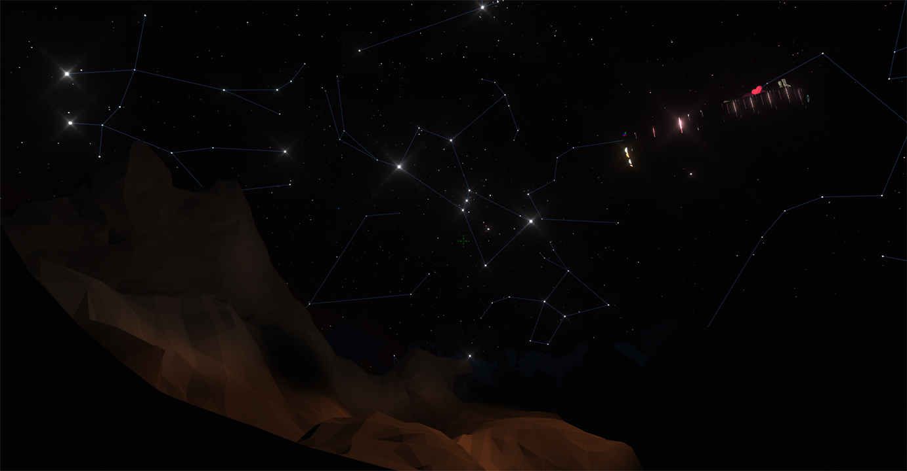

# Astronomic Skybox
 Realtime, true-to-life, star and sky simulator for Unity. Perfect for recreating real-world places, time lapse effects, impressive day/night cycles, or just stargazing!




## How it works
* The **skybox** is the bread and butter of this package. Its goal is to simulate the sky as accurately as possible
  * Supports three celestial coordinate systems
    *  The **Horizontal coordinate system** is the view from a given point on earth.
    *  The **Equatorial coordinate system** is centered around Earth and its equator. This is what the stars are mapped to.
    *  The **Ecliptic coordinate system** is centered around Earth in this instance and the orbital plane of the planets.
  *  The coordinate systems are rotated to accurately simulate the positions of objects in the sky at any given time.
  *  It also provides direct sun lighting, an ambient light cluster, and reflected light from the moon.
*  **StarPositioner.cs** orients the skybox to be accurate to specific dates, times and places on Earth.
*  **StarGenerator.cs** generates stars and constellations for the skybox.
*  **StarMath.cs** contains a bunch of methods for converting coordinate systems and calculating the position of the sun and moon.

## Getting it running
* **Add to Unity project**
  * Add the repository directly to a folder in your Unity project.
* **Download star data**
  * Download [**this star data file**](https://github.com/astronexus/HYG-Database/blob/master/hygdata_v3.csv) and set it to ``` Resources/Sky/StellarData.txt```.
* **Handle missing Time Manager**
  * The TimeManager system currently isn't on github. In ```StarPositioner.cs``` replace ```TimeManager.CurrentUniversalTime``` with ```DateTime.UtcNow``` or handle time in some other way.
* **Implement inside a scene**
  * Place ```Assets/Templates/BlankSkybox``` inside your scene.
  * Set the new instance to a layer visible to your skybox camera and move it out of the way.
  * On the skybox, set the StarPositioner latitude and logitude to the point on Earth you want to simulate.
  * Provided you downloaded the star data, clicking **Generate Stars** will add star meshes and constellations to your skybox
    * It's a good idea to save the skybox with the new generated assets to a new prefab.
  * The skybox will automatically reorient to whatever DateTime it is provided with.
  * Good to go!